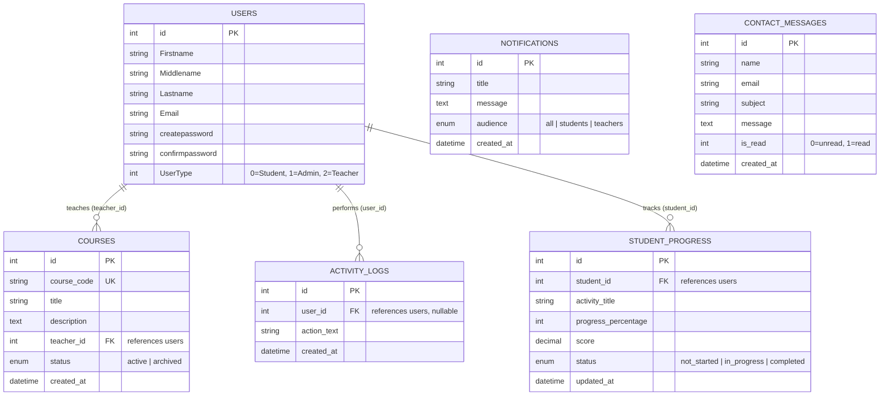
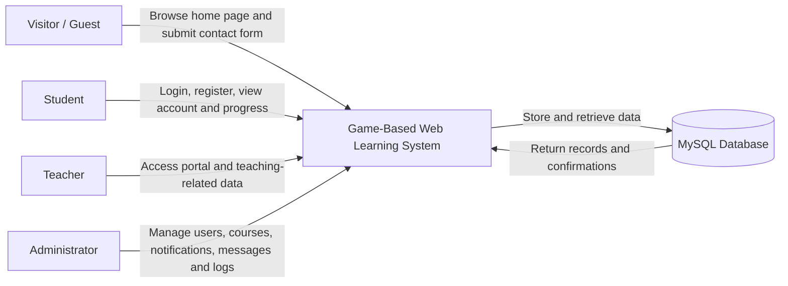
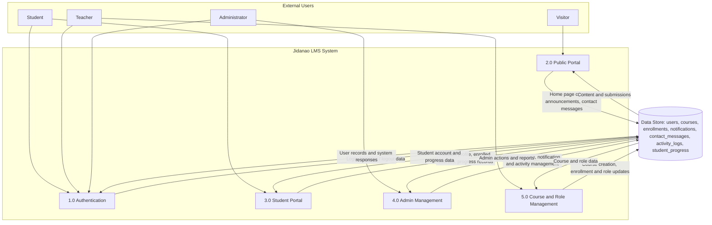

# Jidanao LMS — Data Model (ER Diagram)

```mermaid
erDiagram
    USERS ||--o{ COURSES : "teaches (teacher_id)"
    USERS ||--o{ ACTIVITY_LOGS : "performs (user_id)"
    USERS ||--o{ STUDENT_PROGRESS : "tracks (student_id)"

    USERS {
        int id PK
        string Firstname
        string Middlename
        string Lastname
        string Email
        string createpassword
        string confirmpassword
        int UserType "0=Student, 1=Admin, 2=Teacher"
    }

    COURSES {
        int id PK
        string course_code UK
        string title
        text description
        int teacher_id FK "references users"
        enum status "active | archived"
        datetime created_at
    }

    NOTIFICATIONS {
        int id PK
        string title
        text message
        enum audience "all | students | teachers"
        datetime created_at
    }

    ACTIVITY_LOGS {
        int id PK
        int user_id FK "references users, nullable"
        string action_text
        datetime created_at
    }

    CONTACT_MESSAGES {
        int id PK
        string name
        string email
        string subject
        text message
        int is_read "0=unread, 1=read"
        datetime created_at
    }

    STUDENT_PROGRESS {
        int id PK
        int student_id FK "references users"
        string activity_title
        int progress_percentage
        decimal score
        enum status "not_started | in_progress | completed"
        datetime updated_at
    }
```

# Jidanao LMS — Data Flow Diagrams

## DFD Level 0

```mermaid
flowchart LR
    Visitor[Visitor / Guest]
    Student[Student]
    Teacher[Teacher]
    Admin[Administrator]
    LMS[Game-Based Web Learning System]
    DB[(MySQL Database)]

    Visitor -->|Browse home page and submit contact form| LMS
    Student -->|Login, register, view account and progress| LMS
    Teacher -->|Access portal and teaching-related data| LMS
    Admin -->|Manage users, courses, notifications, messages and logs| LMS

    LMS -->|Store and retrieve data| DB
    DB -->|Return records and confirmations| LMS
```

## DFD Level 1

```mermaid
flowchart TD
    subgraph Users[External Users]
        V[Visitor]
        S[Student]
        T[Teacher]
        A[Administrator]
    end

    subgraph System[Jidanao LMS System]
        P1[1.0 Authentication]
        P2[2.0 Public Portal]
        P3[3.0 Student Portal]
        P4[4.0 Admin Management]
        P5[5.0 Course and Role Management]
    end

    DS[(Data Store: users, courses, enrollments, notifications, contact_messages, activity_logs, student_progress)]

    V --> P2
    S --> P1
    S --> P3
    T --> P1
    T --> P5
    A --> P1
    A --> P4

    P1 -->|Login / register / logout data| DS
    P2 -->|Home page content, announcements, contact messages| DS
    P3 -->|Account profile, enrolled courses, progress records| DS
    P4 -->|User, message, notification and activity management| DS
    P5 -->|Course creation, enrollment and role updates| DS

    DS -->|User records and system responses| P1
    DS -->|Content and submissions| P2
    DS -->|Student account and progress data| P3
    DS -->|Admin actions and reports| P4
    DS -->|Course and role data| P5
```

