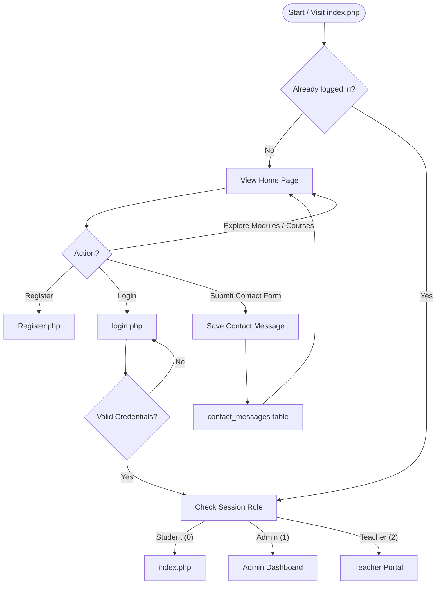
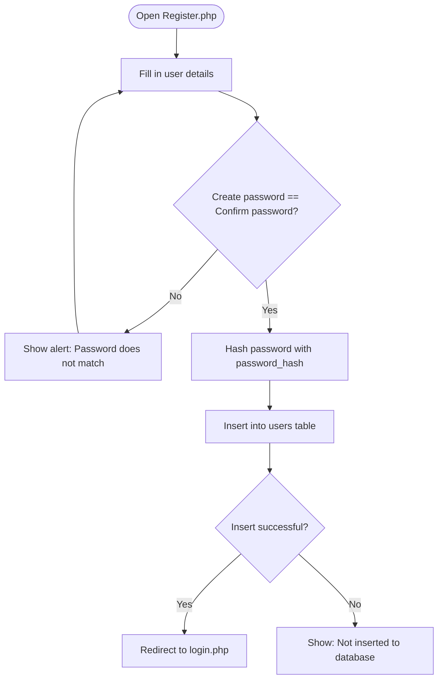
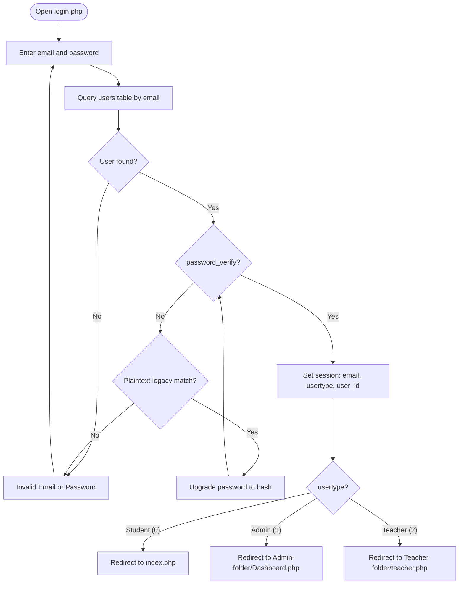
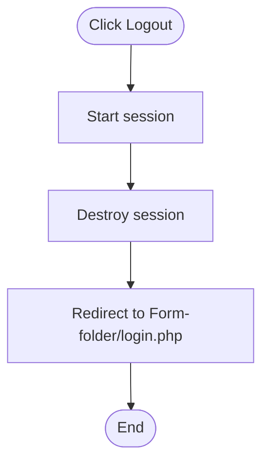
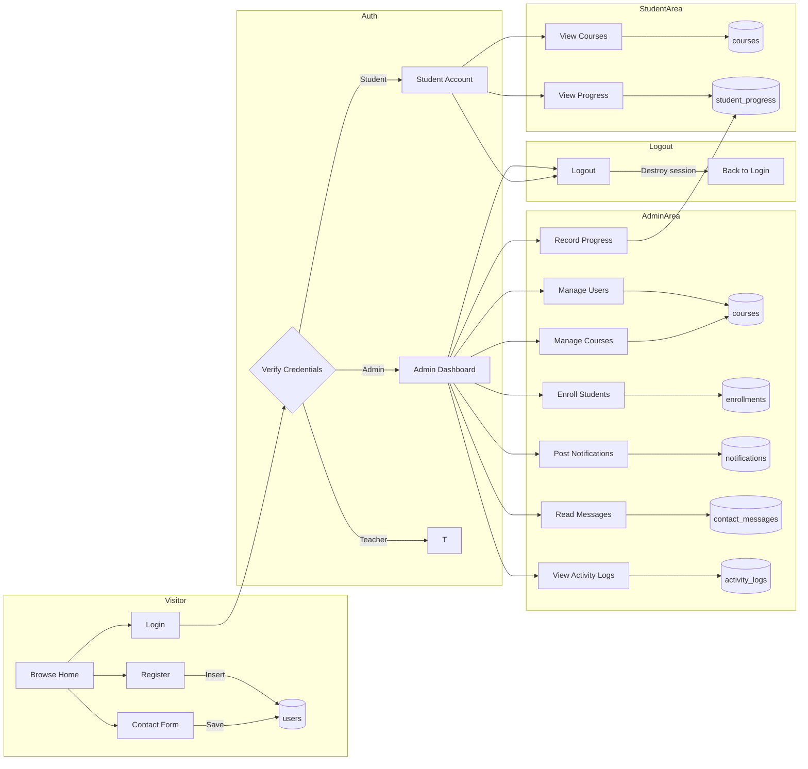

# Jidanao LMS — System Flowchart

This document describes the flow of the Jidanao LMS system using Mermaid flowcharts. Each chart reflects the actual logic implemented in the codebase.

---

## 1. Main System Flow (Overview)



---

## 2. Registration Flow (Register.php)



---

## 3. Login / Authentication Flow (login.php)



---

## 4. Admin Dashboard Flow (Dashboard.php)

```mermaid
flowchart TD
    A([Open Dashboard.php]) --> B{Is usertype Admin (1)?}
    B -- No --> C[Redirect to login.php]
    B -- Yes --> D[Ensure LMS tables exist]
    D --> E{POST action?}
    E -- create_course --> F[Validate code & title]
    F --> G{Valid?}
    G -- No --> H[Flash: error]
    G -- Yes --> I[Insert course]
    I --> J[Log activity]
    J --> K[Insert notification: New course available]
    K --> L[Flash: success]
    E -- archive_course --> M[Toggle course status]
    M --> J
    E -- enroll_student --> N[Insert enrollment]
    E -- update_role --> O[Update UserType]
    E -- post_notification --> P[Insert notification]
    L --> Q[Load stats, courses, users, activities]
    H --> Q
    Q --> R([Render Admin Dashboard])
```

---

## 5. User Management Flow (users.php)

```mermaid
flowchart TD
    A([Open users.php]) --> B{Is usertype Admin (1)?}
    B -- No --> C[Redirect to login.php]
    B -- Yes --> D[Ensure student_progress table]
    D --> E{POST action?}
    E -- create --> F[Validate fields & password length]
    F --> G{Valid?}
    G -- No --> H[Flash: error]
    G -- Yes --> I[Hash password & insert user]
    I --> J[Flash: success]
    E -- update --> K[Validate, cannot edit self]
    K --> L[Update user]
    E -- delete --> M[Delete user]
    E -- progress --> N[Validate progress details]
    N --> O[Insert student_progress]
    E -- delete_progress --> P[Delete progress record]
    J --> Q([Load users, students, progress & render])
    H --> Q
    L --> Q
    M --> Q
    O --> Q
    P --> Q
```

---

## 6. Notifications Flow (notifications.php)

```mermaid
flowchart TD
    A([Open notifications.php]) --> B{Is usertype Admin (1)?}
    B -- No --> C[Redirect to login.php]
    B -- Yes --> D{POST action?}
    D -- post_notification --> E[Validate title, message, audience]
    E --> F{Valid?}
    F -- No --> G[Flash: error]
    F -- Yes --> H[Insert notification]
    H --> I[Flash: success]
    D -- delete --> J[Delete notification by id]
    D -- clear_all --> K[Delete all notifications]
    I --> L([Count & list notifications, render])
    G --> L
    J --> L
    K --> L
```

---

## 7. Messages Flow (messages.php + index.php contact form)

```mermaid
flowchart TD
    subgraph Public ["Visitor (index.php)"]
        A[Fill contact form] --> B{Name, valid email, message?}
        B -- No --> C[Show validation error]
        B -- Yes --> D[Insert into contact_messages]
        D --> E[Show success message]
    end

    subgraph Admin ["Administrator (messages.php)"]
        F[Open messages.php] --> G{Is usertype Admin (1)?}
        G -- No --> H[Redirect to login.php]
        G -- Yes --> I{POST action?}
        I -- toggle_read --> J[Toggle is_read status]
        I -- delete --> K[Delete contact message]
        J --> L([Count total/unread, list messages, render])
        K --> L
    end

    E --> F
```

---

## 8. Activity Logs Flow (activity.php)

```mermaid
flowchart TD
    A([Open activity.php]) --> B{Is usertype Admin (1)?}
    B -- No --> C[Redirect to login.php]
    B -- Yes --> D{POST action?}
    D -- delete --> E[Delete log entry by id]
    D -- clear_all --> F[Delete all activity logs]
    E --> G([Count total/today, list activity, render])
    F --> G
```

---

## 9. Student Account Flow (account.php)

```mermaid
flowchart TD
    A([Open account.php]) --> B{Logged in as Student (0)?}
    B -- No --> C[Redirect to login.php]
    B -- Yes --> D[Fetch student profile from users]
    D --> E{Profile exists?}
    E -- No --> F[Destroy session & redirect to login]
    E -- Yes --> G[Fetch enrolled courses]
    G --> H[Fetch student progress records]
    H --> I[Calculate average progress & completed count]
    I --> J([Render student account dashboard])
```

---

## 10. Logout Flow (logout.php)



---

## 11. Combined System Flowchart (All Actors)



---

> **Legend:** Rounded rectangles represent pages/processes, diamonds represent decision points, and cylinders represent database tables. The flowcharts are written in Mermaid, so they render natively in GitHub/GitLab and any Markdown viewer that supports Mermaid.
